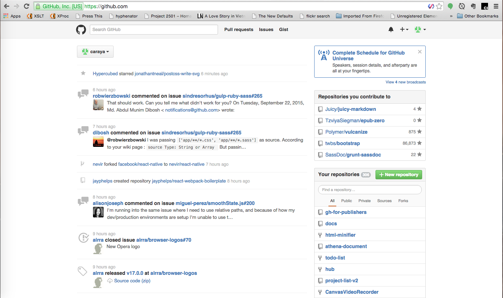
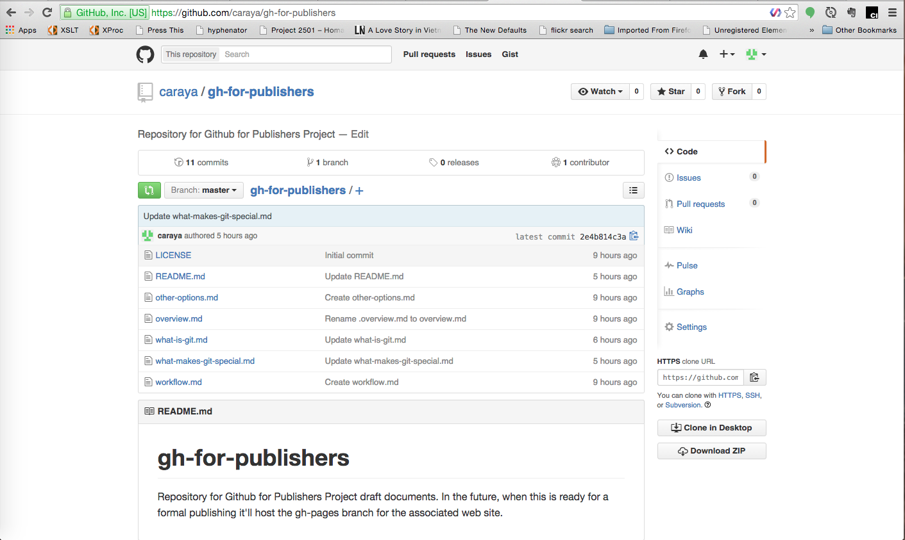
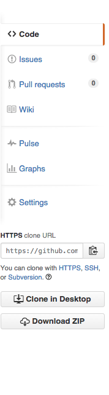

# Github for Publishers

This series will explore GIT, what it is, what options do we have to use it and how can we best leverage the technology in a publishing environment.

## Version Control 

**What is "version control", and why should you care?**

Version control is a system that records changes to a file or set of files over time so that you can recall specific versions later. For the examples in this book you will use software source code as the files being version controlled, though in reality you can do this with nearly any type of file on a computer.

If you are a graphic or web designer and want to keep every version of an image or layout (which you would most certainly want to), a Version Control System (VCS) is a very wise thing to use. It allows you to revert files back to a previous state, revert the entire project back to a previous state, compare changes over time, see who last modified something that might be causing a problem, who introduced an issue and when, and more. Using a VCS also generally means that if you screw things up or lose files, you can easily recover. In addition, you get all this for very little overhead.

### Local Version Control Systems

Many people’s version-control method of choice is to copy files into another directory (perhaps a time-stamped directory, if they’re clever). This approach is very common because it is so simple, but it is also incredibly error prone. It is easy to forget which directory you’re in and accidentally write to the wrong file or copy over files you don’t mean to.

To deal with this issue, programmers long ago developed local VCSs that had a simple database that kept all the changes to files under revision control.

One of the more popular VCS tools was a system called RCS, which is still distributed with many computers today. Even the popular Mac OS X operating system includes the rcs command when you install the Developer Tools. RCS works by keeping patch sets (that is, the differences between files) in a special format on disk; it can then re-create what any file looked like at any point in time by adding up all the patches.

### Centralized Version Control Systems

The next major issue that people encounter is that they need to collaborate with developers on other systems. To deal with this problem, Centralized Version Control Systems (CVCSs) were developed. These systems, such as CVS, Subversion, and Perforce, have a single server that contains all the versioned files, and a number of clients that check out files from that central place. For many years, this has been the standard for version control.

This setup offers many advantages, especially over local VCSs. For example, everyone knows to a certain degree what everyone else on the project is doing. Administrators have fine-grained control over who can do what; and it’s far easier to administer a CVCS than it is to deal with local databases on every client.

However, this setup also has some serious downsides. The most obvious is the single point of failure that the centralized server represents. If that server goes down for an hour, then during that hour nobody can collaborate at all or save versioned changes to anything they’re working on. If the hard disk the central database is on becomes corrupted, and proper backups haven’t been kept, you lose absolutely everything – the entire history of the project except whatever single snapshots people happen to have on their local machines. Local VCS systems suffer from this same problem – whenever you have the entire history of the project in a single place, you risk losing everything.

### Distributed Version Control Systems

This is where Distributed Version Control Systems (DVCSs) step in. In a DVCS (such as Git, Mercurial, Bazaar or Darcs), clients don’t just check out the latest snapshot of the files: they fully mirror the repository. Thus if any server dies, and these systems were collaborating via it, any of the client repositories can be copied back up to the server to restore it. Every clone is really a full backup of all the data.

Furthermore, many of these systems deal pretty well with having several remote repositories they can work with, so you can collaborate with different groups of people in different ways simultaneously within the same project. This allows you to set up several types of workflows that aren’t possible in centralized systems, such as hierarchical models.

## History of Git

As with many great things in life, Git began with a bit of creative destruction and fiery controversy.

The Linux kernel is an open source software project of fairly large scope. For most of the lifetime of the Linux kernel maintenance (1991–2002), changes to the software were passed around as patches and archived files. In 2002, the Linux kernel project began using a proprietary DVCS called BitKeeper.

In 2005, the relationship between the community that developed the Linux kernel and the commercial company that developed BitKeeper broke down, and the tool’s free-of-charge status was revoked. This prompted the Linux development community (and in particular Linus Torvalds, the creator of Linux) to develop their own tool based on some of the lessons they learned while using BitKeeper. Some of the goals of the new system were as follows:

* Speed
* Simple design
* Strong support for non-linear development (thousands of parallel branches)
* Fully distributed
* Able to handle large projects efficiently (speed and data size)

Since its birth in 2005, Git has evolved and matured to be easy to use and yet retain these initial qualities. It’s incredibly fast, it’s very efficient with large projects, and it has an incredible branching system for non-linear development (See Git Branching).

### Github in detail

#### The main repository interface

> This article assumes that you've already created an account on Github. Other than that we'll start from scratch. 

&nbsp;

> Not all the activities in this article will apply to all types of project. We'll strive for completion in addressing everything in the UI but not all aspects of Github work for everything

When you log in to Github, you'll see something similar to the screen below.

The left side of the screen contains your social feed. Information about projects you've stared, people you've chosen to follow and information about pull requests in your projects or those you're collborating or following.

The right side of the screen has two repository listings: The top one contains repositories you've collborated on either by commenting, submitting a pull request or commenting on a PR.

The second set of repositories are those you own. You've created them and now are your responsibility. 

## Github and Alternatives

# Concepts and Terminology

## Repository

I am using the repository for this project [gh-for-publishers](https://github.com/caraya/gh-for-publishers) as the model repository moving forward

### What does the repository offer?

In order to understand the repository interface, let's look at the different areas of the repository, what they do and how we can best leverage them in a publishing environment. 

#### Watches, Stars and Forks

These three elements indicate the popularity of your repository.  Each one of these items has a number associated with it and indicates how many people have performed that action. From left to right:

* Watches indicate how many people are following the conversation on/about your repository
* Stars indicated how many people have starred your repository, they like it but they are not so interested in the social aspects
* Forks indicated how many people have forked or copied your repository

This information may not be relevant for smaller projects or those where you work directly with your client and no one else. Still they help measure the health of a repository and associated project. The example below is from the [Twitter Bootstrap](https://github.com/twbs/bootstrap) repository.

#### Information about the repository

Right above the list of files on your repository there are 4 icons. They explain your repository's status. From left to right they are:

* Number of commits: how many times has content been saved to the repository
* Number of branches: how many different branches of content exist in your repository (we'll discuss branches later in the document)
* Number of releases: how many releases have you made from the code in the repository?
* Number of collaborators: how many people are helping in the repository

#### What you can do with the repo

To the right of the repository window there are a series of links for activities that you can perform with your repository and/or its content. It is grouped in 5 areas. 

The first area provides tools to work with the repository content. From top to bottom:

* **Code** is the default view and it shows the content of your repository
* **Issues** list issues for your repository; you can choose whether to see open or closed issues. You can also open a new issue from here
* **Pull requests** lists pull requests for the project; you can choose whether to see open or closed PRs. Pull requests are how you contribute to a project if you're not the project owner or a collaborator
* **Wiki** content allows you to view the content of the project's wiki and add new pages

The second block provides information about your repository

* **Pulse** gives you a graphical view of number of open and closes issues and pull requests
* **Graph** creates multiple graphics for activity in the repository

The third block controls your repository settings

* **Settings**

The fourth block provides additional ways to download your repository

* **HTTPS clone URL** gives the URL you can use with command line or graphical tools outside Github
* **Clone in Desktop** provides for a way to use [Github Desktop](https://desktop.github.com/) with your repository
* **Download ZIP** packs the content of your repository into a zip file for download

## Branches

## Issues

## Pull Requests

# Case Studies and Ideas

## Single Developer

## Local Team

## Geographically Distributed Team
