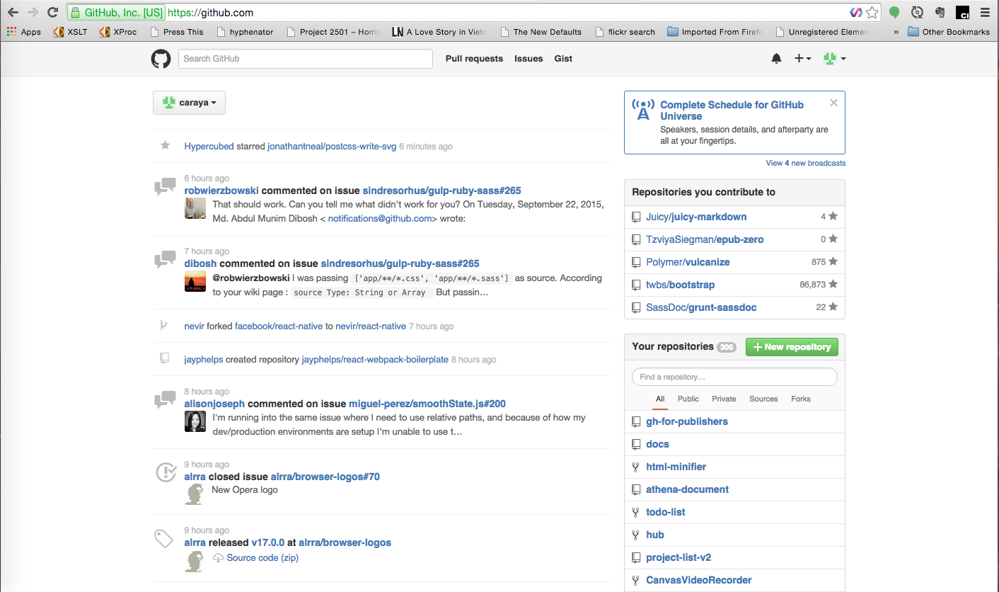

# Github User Interface

> This article assumes that you've already created an account on Github. Other than that we'll start from scratch. 

&nbsp;

> Not all the activities in this article will apply to all types of project. We'll strive for completion in addressing everything in the UI but not all aspects of Github work for everything

When you log in to Github, you'll see something similar to the screen below.

The left side of the screen contains your social feed. Information about projects you've stared, people you've chosen to follow and information about pull requests in your projects or those you're collborating or following.

The right side of the screen has two repository listings: The top one contains repositories you've collborated on either by commenting, submitting a pull request or commenting on a PR.

The second set of repositories are those you own. You've created them and now are your responsibility. 

## What a repository look like?

I am using the repository for this project [gh-for-publishers](https://github.com/caraya/gh-for-publishers) as the model repository moving forward

## What does the repository offer?

## Creating a repository

There are two ways to create a new repository

