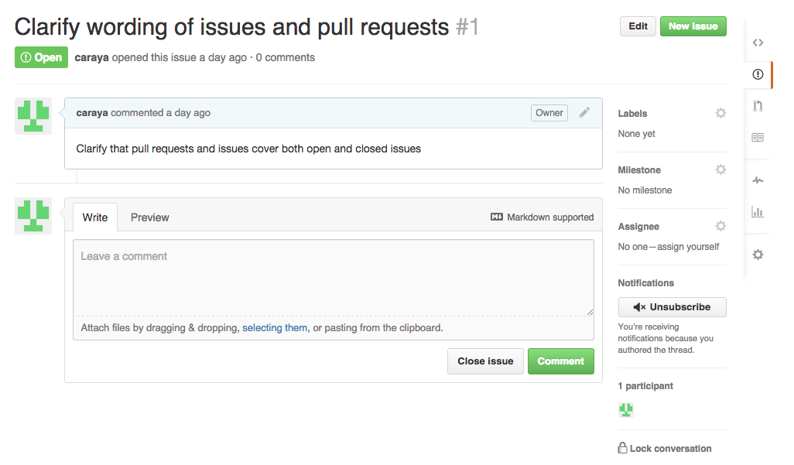
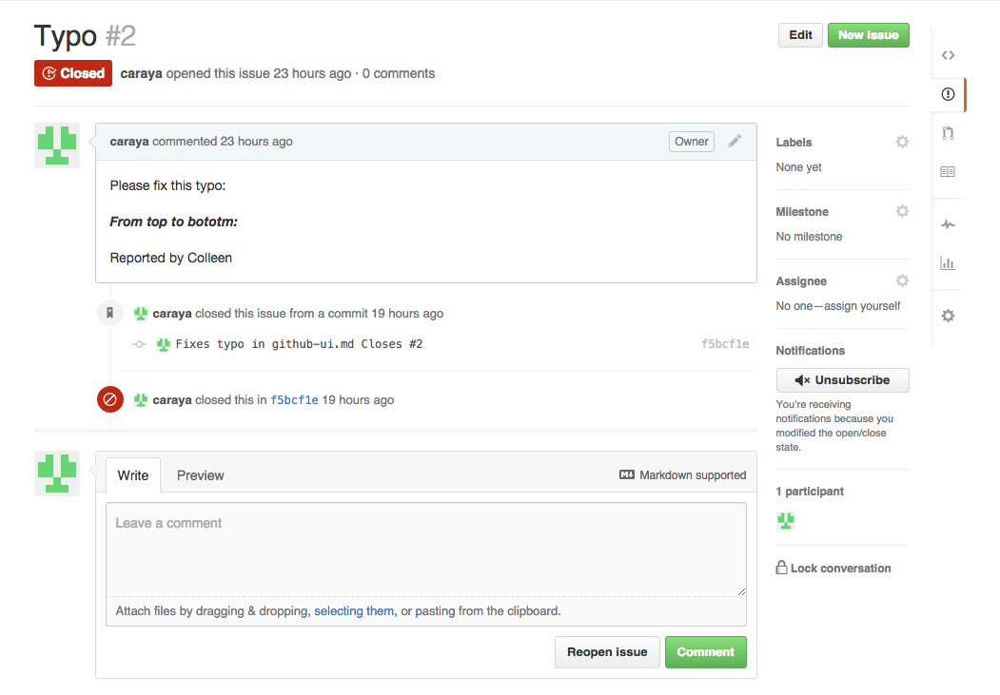
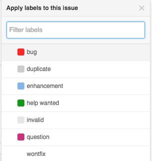
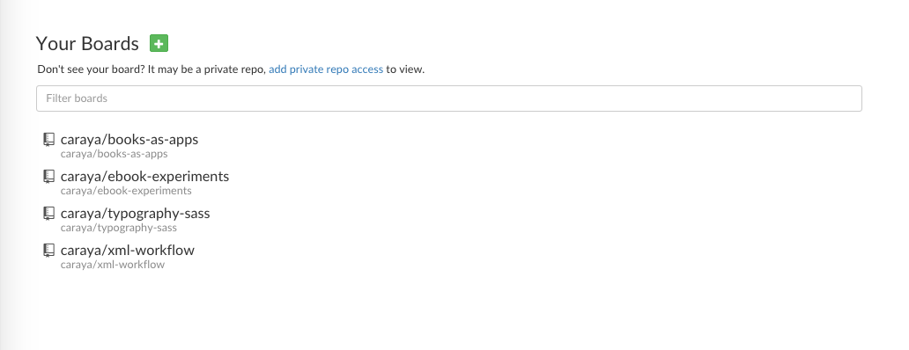
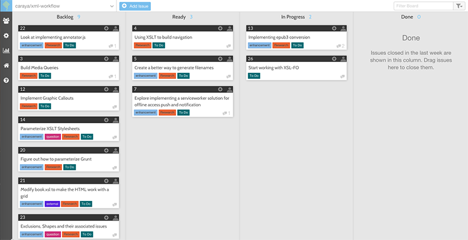

# Github Issues: A Tool for Communication

Issues were originally conceived as a means to communicate problems with the content of the repository and to engage in discussion about issues in the repository.  We can also use issues to ask question and engage in wider discussions regarding the project current status or its future. 

I've seeded two issues in the `gh-for-publishers` repository. Both have been solved yet I chose to leave one open to show what open and closed issues look like.

## Open Issues

## Closed Issues

## Issue Labels

You can create more labels to suit your project too

## External Issue Managemnt Tools

[Waffle.io](https://waffle.io/) is my go to tool when I need to work with lots of issues or I need to bring external audiences who may not be comfortable with Github's user interface. 

