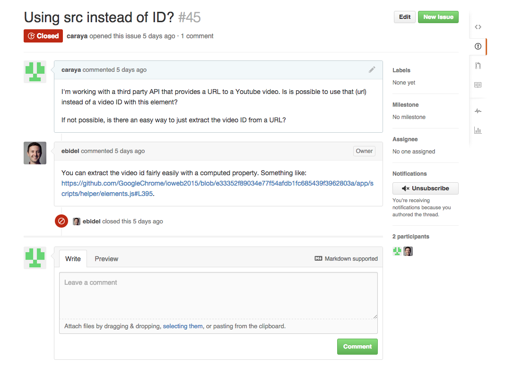
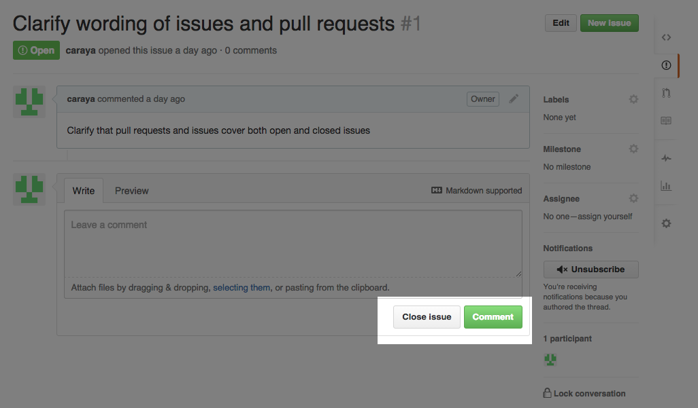
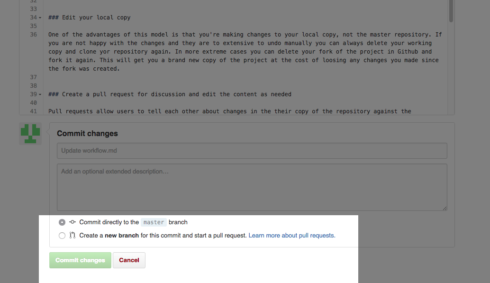
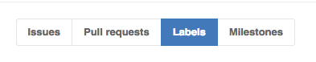
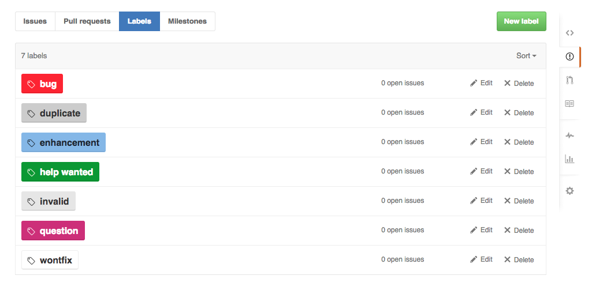
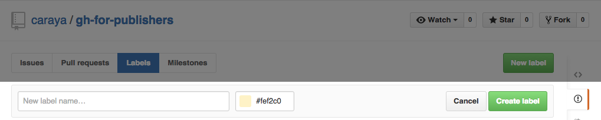

# Github Issues: A Tool for Communication


Issues were originally conceived as a means to communicate problems with the content of the repository and to engage in discussion about issues in the repository.  We can also use issues to ask question and engage in wider discussions regarding the project current status or its future. 

I've seeded two issues in the `gh-for-publishers` repository. Both have been solved yet I chose to leave one open to show what open and closed issues look like and also showing how to close issues manually.

## Open Issues

When you first create an issue is in the open state. Open issues have been posted and reported to the owner of the repository but they have not been acted upon yet. The user can provide additional information and those working on the issue can request additional information to better solve the problem.


Once a fix has been provided or enough information either party can close the issue. This is one way to say that the issue has been resolved and that no further work is necessary. The developer can also indicate that he won't fix the issue by stating so in a comment or using the `wontfix` label (more on those later.)

To the right of the issue there are 4 items that merit attention:

* **Labels** are graphical ways to indicate additional data about the issue
* **Milestone** indicates what milestone will address the issue
* **Asignee** tells people who is working on this particular issue. When it's just you then the asignee is obvious but as your team grows larger it may not be as clear
* **Notifications** by default changes to your issues will appear in your Github's social feed. Unsubscribing will mute the issue
* **Participants** tell you who has participated in the conversation about the issue

You can close the issue by clicking the `close issue` button to the left of the `comment` button.

## Closed Issues

Once an issue is closed it is considered done; no further work needs to be done in this issue and the team can move on. They are not deleted and can be searched when looking for the project's history and for new people looking if the community has already dealt with a given issue before and what was the resolution. The example below shows a closed issue. 


This example shows a closed issue with multiple participants indicating who closed the issue and when it was closed.



### Different ways to close issues

So far we've seen what the issue looks like but we haven't quite discussed how to close issues in our repository. There are 3 diffrent ways to close the issue. From simple to complex they are:

* Manually closing the issue
* Fixing issue and closing in commit message
* Creating branch and opening pull request

We'll discuss each one in turn.

#### Manually closing issues

The easiest way to close an issue in Github is to do so manually by clicking the close issue button located at the bottom of the issue, to the left of the comment button as show in the image bellow.



#### Fixing issue and closing in commit message

The next way to close an issue is to do so from the commit message. We haven't addressed how to commit files so take my word for it right now. When editing a document you can add a message to the commit to indicate the issue is closed. Github is smart enough to pick up on it and close the issue for you. 



In the message box (right below the Commit changes header) you can type a message to explain the changes you made. For example:

```
Fixed typo in github-ui.md
```

To this message you can add information about the issue it closes:

```
Fixed typo in github-ui.md. Closes #2
```

This will commit the changes you made and automatically close issue #2 in your repository.

#### Creating branch and opening pull request

The third way to close an issue is the most complex as it requires you to understand [branches](https://git-scm.com/book/en/v2/Git-Branching-Branches-in-a-Nutshell) and, in particular, [feature branches](https://www.atlassian.com/git/tutorials/comparing-workflows/feature-branch-workflow) in order to make this work.

From the commit dialogue we can create a branch and submit a pull request.


This will commit the changes, it will open a pull request and send it to the repository owner. Again, if you are the only one working on the repository you will be the only one seeing the communication but if you're working with a team it will help others know what your intended change is and, therefore, make it easier to approve the change.

We'll explore branches in more detail in a separate document.

## Issue Labels

Labels help further refine issues with categories. Github gives you 7 default categories common to all repositories. They are shown below:


You can create more labels to suit your project based on whatever criteria you need to work with. For example, in a publishing project you can define additional labels for:

* Needs editing
* Needs illustrations
* Client review

And any others that you may think of. 

To create new labels go to the issues tab and select labels, as show in the image below:



It will show this screen:



Click on the green `New label` button on the top left of the label list and you'll get the dialogue below where you can pick the name and the color for the new label.



After you create them you can use your new label for all issues and pull requests.

## External Issue Managemnt Tools

There are times when managing issues in a repository can be overwhelming, particularly when you work in large projects or in projects with large teams and many collaborators. In times like these it may be better to use a third party tool to manage the issues on your repository.

[Waffle.io](https://waffle.io/) is my go to tool when I need to work with lots of issues or I need to bring external audiences who may not be comfortable with Github's user interface. 


